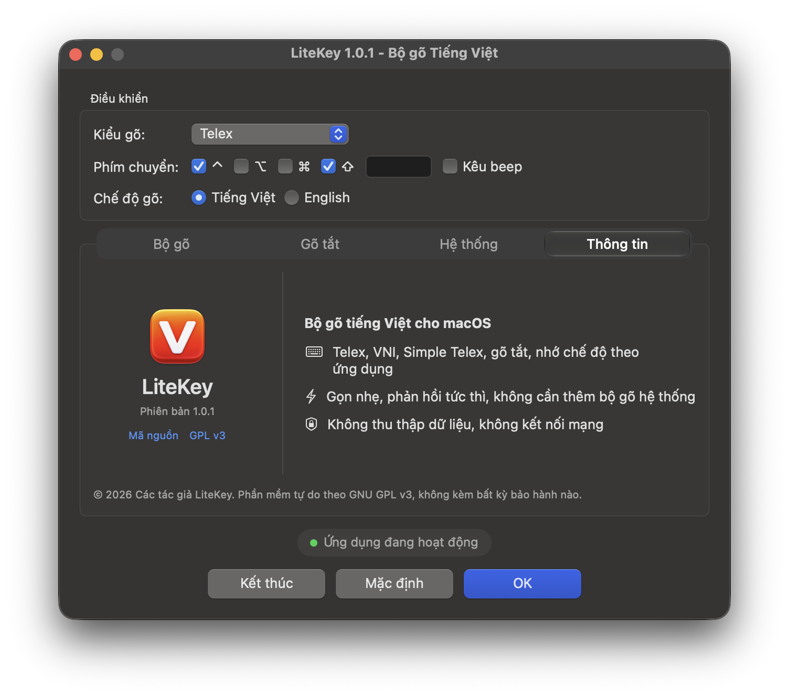
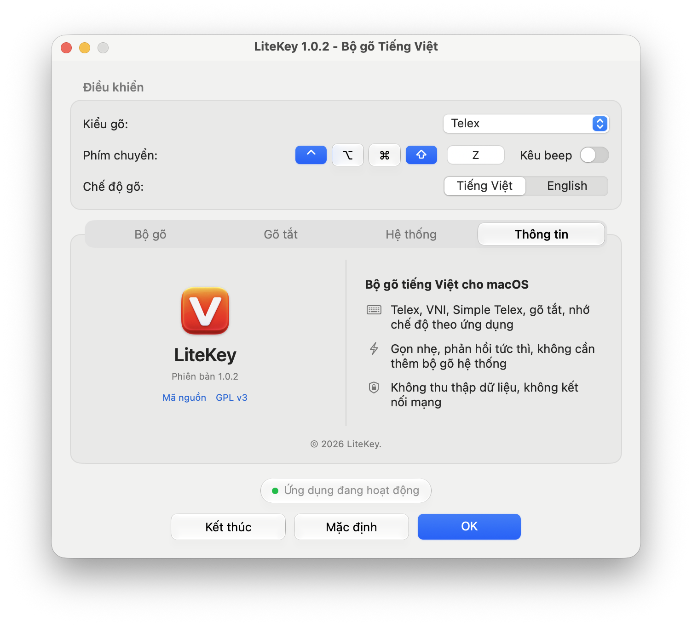

<p align="center">
  
</p>

<h1 align="center">LiteKey</h1>

<p align="center">
  Bộ gõ tiếng Việt cho macOS.<br>
  Miễn phí, mã nguồn mở, không thu thập dữ liệu.
</p>

<p align="center">
  
  
  
  
  <a href="LICENSE"></a>
</p>

<p align="center">
  <a href="https://github.com/quocbaodsk/litekey/releases"><b>Tải về</b></a>
  &nbsp;·&nbsp; <a href="#cài-đặt">Cài đặt</a>
  &nbsp;·&nbsp; <a href="#câu-hỏi-thường-gặp">Câu hỏi thường gặp</a>
  &nbsp;·&nbsp; <a href="docs/BUILDING.md">Tự build từ mã nguồn</a>
</p>

<p align="center">
  <b>Tiếng Việt</b> &nbsp;·&nbsp; <a href="README.en.md">English</a>
</p>

---

> [!IMPORTANT]
> LiteKey đang ở giai đoạn beta. Đây là dự án cá nhân mình dùng hằng ngày và chia sẻ để ai cần thì dùng.
> Có thể còn lỗi và thay đổi giữa các bản phát hành.
> Báo lỗi xin gửi ở [Issues](https://github.com/quocbaodsk/litekey/issues).

## Giới thiệu

LiteKey là bộ gõ tiếng Việt chạy trên thanh menu của macOS, viết bằng Swift. Bộ máy gõ được kiểm thử với hơn
10.000 chuỗi phím đã ghi lại, và mỗi phím được xử lý trong chưa tới một mili giây, nên gõ nhanh trong trình
duyệt, VS Code, Slack hay Terminal cũng không bị mất chữ. LiteKey không bao giờ kết nối mạng.

<p align="center">
  
</p>

<p align="center">
  
</p>

## Tính năng

### Gõ phím

- Telex, VNI, Simple Telex 1 và 2
- Đặt dấu kiểu cũ (òa, úy) hoặc kiểu mới (oà, uý), bỏ dấu tự do
- Kiểm tra chính tả, tự khôi phục từ tiếng Anh: gõ `class` vẫn ra `class`
- Telex nhanh (cc → ch, gg → gi…), gõ tắt phụ âm đầu/cuối, tự viết hoa chữ đầu câu

### Gõ tắt

- Bảng gõ tắt riêng, viết hoa theo cách bạn gõ từ tắt
- Dùng được cả khi đang ở chế độ tiếng Anh
- Nhập và xuất tệp tương thích UniKey và OpenKey

### Theo từng ứng dụng

- Nhớ chế độ Việt/Anh cho từng ứng dụng
- Danh sách ứng dụng luôn gõ tiếng Anh
- Tự tạm dừng khi bạn chuyển sang nguồn nhập khác của hệ thống

### Khác

- Chuyển Việt/Anh bằng ⌃⇧, ⌥Z, ⌃⌥ hoặc ⌃Space; ⌥-click vào biểu tượng trên thanh menu để bật/tắt
- Nhấn ⌃ để tắt kiểm tra chính tả cho từ đang gõ, hoặc ⌘ để tắt LiteKey cho từ đó
- Cảnh báo khi ô mật khẩu đang giữ bàn phím (Secure Input) hoặc có bộ gõ tiếng Việt khác đang chạy
- Khởi động cùng macOS, tuỳ chọn hiện biểu tượng trên Dock

## Yêu cầu

- macOS 13 Ventura trở lên
- Máy Mac dùng Apple Silicon (M1 trở lên)
- Quyền Trợ năng (Accessibility), để đọc và thay thế phím gõ

## Cài đặt

1. Tải bản mới nhất ở [Releases](https://github.com/quocbaodsk/litekey/releases), giải nén rồi kéo **LiteKey**
   vào **Applications**. Chưa có bản phù hợp? Xem [Tự build từ mã nguồn](docs/BUILDING.md).
2. Mở LiteKey và bật nó trong **Cài đặt hệ thống → Quyền riêng tư & Bảo mật → Trợ năng**.
3. Biểu tượng **V** xuất hiện trên thanh menu. Nhấn rồi thả **⌃⇧** để chuyển giữa tiếng Việt và tiếng Anh.

Đang dùng OpenKey? Nhập cài đặt và bảng gõ tắt từ bảng điều khiển của LiteKey, rồi thoát OpenKey để hai bộ gõ
không cùng xử lý một phím.

## Quyền riêng tư

LiteKey cần quyền Trợ năng để đọc phím gõ và thay bằng chữ có dấu; mọi bộ gõ dựa trên event tap trên macOS đều
cần quyền này. LiteKey không có mã kết nối mạng, không có analytics, không lưu bất cứ thứ gì bạn gõ, và cài đặt
chỉ nằm trong UserDefaults trên máy bạn.

## Câu hỏi thường gặp

<details>
<summary><b>Không bỏ dấu được, hoặc bị mất chữ?</b></summary>

Kiểm tra nguồn nhập của macOS (góc trên bên phải thanh menu) đang là **ABC** và không có bộ gõ tiếng Việt nào
khác đang chạy. Nếu có, LiteKey hiện ⚠︎ trên biểu tượng và cho biết tên bộ gõ cần thoát.

</details>

<details>
<summary><b>macOS báo không thể mở ứng dụng?</b></summary>

Vào **Cài đặt hệ thống → Quyền riêng tư & Bảo mật** và bấm **Vẫn mở** cạnh thông báo về LiteKey.

</details>

<details>
<summary><b>Đã cấp quyền Trợ năng nhưng vẫn không gõ được?</b></summary>

Sau khi cập nhật, đôi khi macOS vẫn gắn quyền với bản build cũ. Xoá LiteKey khỏi danh sách Trợ năng bằng nút
**−**, mở lại LiteKey và cấp quyền lần nữa.

</details>

<details>
<summary><b>Gỡ cài đặt LiteKey thế nào?</b></summary>

Thoát LiteKey từ menu của nó, xoá ứng dụng khỏi Applications, rồi xoá nó khỏi danh sách Trợ năng.

</details>

## Đóng góp

Khi báo lỗi, vui lòng ghi phiên bản macOS, ứng dụng bạn đang gõ, các phím đã nhấn, kết quả mong đợi và kết quả
thực tế.

Cách build và chạy test xem ở [docs/BUILDING.md](docs/BUILDING.md); thiết kế được mô tả trong
[docs/ARCHITECTURE.md](docs/ARCHITECTURE.md). Vui lòng mở issue trước khi bắt tay vào thay đổi lớn.

## Cấu trúc dự án

Phụ thuộc chỉ đi một chiều: LiteKey (app) → LiteKeyPlatform → LiteKeyCore → LiteKeyEngine. Engine và Core là
Swift thuần và được test trên Linux; Platform là lớp macOS mỏng.

```
Sources/
  LiteKeyEngine/       Bộ máy gõ (Telex/VNI, chính tả, gõ tắt)
  LiteKeyCore/         Logic thuần
    Input/             Sự kiện phím, xử lý phím, phím chuyển, tương thích bố cục bàn phím
    Injection/         Kế hoạch gửi phím, quy tắc theo ứng dụng, settle gate
    Preferences/       Tuỳ chọn, nhập cài đặt OpenKey, nhớ chế độ theo ứng dụng
    System/            Tình trạng event tap, phát hiện bộ gõ khác
  LiteKeyPlatform/     Lớp macOS mỏng
    EventTap/          Event tap, chuẩn hoá sự kiện, pipeline, gửi phím
    Monitors/          Quyền, nguồn nhập, bộ gõ khác, Secure Input
    System/            Focus probe (AX), khởi động cùng macOS, chẩn đoán
  LiteKey/             App: main.swift, AppDelegate (composition root)
    MenuBar/           Biểu tượng thanh menu
    ControlPanel/      Bảng điều khiển, trình sửa gõ tắt
    Permission/        Cửa sổ cấp quyền Trợ năng
    Preferences/       Lưu tuỳ chọn (UserDefaults)
Tests/
  LiteKeyEngineTests/  Test bộ máy gõ, gồm các fixture trong Tests/fixtures
  LiteKeyCoreTests/    Test logic thuần
  fixtures/            Kết quả gõ mong đợi (không sửa)
Resources/             Info.plist, biểu tượng
scripts/               Công cụ cho CI (kiểm tra app bundle, xcodebuild), đếm dòng
docs/                  Kiến trúc, build, checklist QA, trang giới thiệu
```

## Giấy phép

LiteKey phát hành theo [GNU GPL v3](LICENSE). Xem [CREDITS.md](CREDITS.md) để biết phần ghi nhận.
